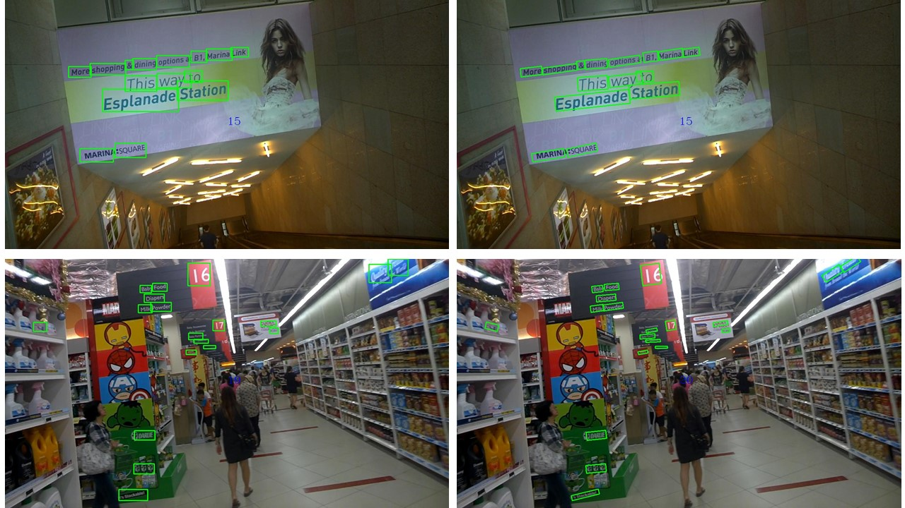

# R2CNN_Faster_RCNN_Tensorflow

## Abstract
This is a tensorflow re-implementation of [R<sup>2</sup>CNN: Rotational Region CNN for Orientation Robust Scene Text Detection](https://arxiv.org/abs/1706.09579).      
It should be noted that we did not re-implementate exactly as the paper and just adopted its idea.    

This project is based on [Faster-RCNN](https://github.com/DetectionTeamUCAS/Faster-RCNN_Tensorflow), and completed by [YangXue](https://github.com/yangxue0827) and [YangJirui](https://github.com/yangJirui).

## [DOTA](https://captain-whu.github.io/DOTA/index.html) test results      


## Comparison 
**Part of the results are from [DOTA](https://arxiv.org/abs/1711.10398) paper.**
### Task1 - Oriented Leaderboard
| Approaches | mAP | PL | BD | BR | GTF | SV | LV | SH | TC | BC | ST | SBF | RA | HA | SP | HC |
|------------|:---:|:--:|:--:|:--:|:---:|:--:|:--:|:--:|:--:|:--:|:--:|:---:|:--:|:--:|:--:|:--:|
|[SSD](https://link.springer.com/chapter/10.1007%2F978-3-319-46448-0_2)|10.59|39.83|9.09|0.64|13.18|0.26|0.39|1.11|16.24|27.57|9.23|27.16|9.09|3.03|1.05|1.01|
|[YOLOv2](https://arxiv.org/abs/1612.08242)|21.39|39.57|20.29|36.58|23.42|8.85|2.09|4.82|44.34|38.35|34.65|16.02|37.62|47.23|25.5|7.45| 
|[R-FCN](http://papers.nips.cc/paper/6465-r-fcn-object-detection-via-region-based-fully-convolutional-networks)|26.79|37.8|38.21|3.64|37.26|6.74|2.6|5.59|22.85|46.93|66.04|33.37|47.15|10.6|25.19|17.96|
|[FR-H](https://ieeexplore.ieee.org/abstract/document/7485869/)|36.29|47.16|61|9.8|51.74|14.87|12.8|6.88|56.26|59.97|57.32|47.83|48.7|8.23|37.25|23.05|
|[FR-O](https://arxiv.org/abs/1711.10398)|52.93|79.09|69.12|17.17|63.49|34.2|37.16|36.2|89.19|69.6|58.96|49.4|52.52|46.69|44.8|46.3|
|[R<sup>2</sup>CNN](https://arxiv.org/abs/1706.09579)|60.67|80.94|65.75|35.34|67.44|59.92|50.91|55.81|90.67|66.92|72.39|55.06|52.23|55.14|53.35|48.22|
|[RRPN](https://arxiv.org/pdf/1703.01086)|61.01|88.52|71.20|31.66|59.30|51.85|56.19|57.25|90.81|72.84|67.38|56.69|52.84|53.08|51.94|53.58|
|[ICN](https://arxiv.org/abs/1807.02700)|68.20|81.40|74.30|**47.70**|70.30|64.90|**67.80**|**70.00**|90.80|79.10|78.20|53.60|62.90|**67.00**|64.20|50.20|
|[R<sup>2</sup>CNN++](https://arxiv.org/abs/1811.07126)|**71.16**|**89.66**|**81.22**|45.50|**75.10**|**68.27**|60.17|66.83|**90.90**|**80.69**|**86.15**|**64.05**|**63.48**|65.34|**68.01**|**62.05**|

### Task2 - Horizontal Leaderboard
| Approaches | mAP | PL | BD | BR | GTF | SV | LV | SH | TC | BC | ST | SBF | RA | HA | SP | HC |
|------------|:---:|:--:|:--:|:--:|:---:|:--:|:--:|:--:|:--:|:--:|:--:|:---:|:--:|:--:|:--:|:--:|
|[SSD](https://link.springer.com/chapter/10.1007%2F978-3-319-46448-0_2)|10.94|44.74|11.21|6.22|6.91|2|10.24|11.34|15.59|12.56|17.94|14.73|4.55|4.55|0.53|1.01|
|[YOLOv2](https://arxiv.org/abs/1612.08242)|39.2|76.9|33.87|22.73|34.88|38.73|32.02|52.37|61.65|48.54|33.91|29.27|36.83|36.44|38.26|11.61| 
|[R-FCN](http://papers.nips.cc/paper/6465-r-fcn-object-detection-via-region-based-fully-convolutional-networks)|47.24|79.33|44.26|36.58|53.53|39.38|34.15|47.29|45.66|47.74|65.84|37.92|44.23|47.23|50.64|34.9|
|[FR-H](https://ieeexplore.ieee.org/abstract/document/7485869/)|60.46|80.32|77.55|32.86|68.13|53.66|52.49|50.04|90.41|75.05|59.59|57|49.81|61.69|56.46|41.85|
|[R<sup>2</sup>CNN](https://arxiv.org/abs/1706.09579)|-|-|-|-|-|-|-|-|-|-|-|-|-|-|-|-|
|[FPN](https://arxiv.org/abs/1612.03144)|72.00|88.70|75.10|52.60|59.20|69.40|**78.80**|**84.50**|90.60|81.30|82.60|52.50|62.10|**76.60**|66.30|60.10|
|[ICN](https://arxiv.org/abs/1807.02700)|72.50|90.00|77.70|53.40|**73.30**|**73.50**|65.00|78.20|90.80|79.10|84.80|57.20|62.10|73.50|70.20|58.10|
|[R<sup>2</sup>CNN++](https://arxiv.org/abs/1811.07126)|**75.35**|**90.18**|**81.88**|**55.30**|73.29|72.09|77.65|78.06|**90.91**|**82.44**|**86.39**|**64.53**|**63.45**|75.77|**78.21**|**60.11**|

## Face Detection
Environment: NVIDIA GeForce GTX 1060    
   

## ICDAR2015
   

## Requirements
1、tensorflow >= 1.2     
2、cuda8.0     
3、python2.7 (anaconda2 recommend)    
4、[opencv(cv2)](https://pypi.org/project/opencv-python/) 

## Download Model
1、please download [resnet50_v1](http://download.tensorflow.org/models/resnet_v1_50_2016_08_28.tar.gz)、[resnet101_v1](http://download.tensorflow.org/models/resnet_v1_101_2016_08_28.tar.gz) pre-trained models on Imagenet, put it to data/pretrained_weights.     
2、please download [mobilenet_v2](https://storage.googleapis.com/mobilenet_v2/checkpoints/mobilenet_v2_1.0_224.tgz) pre-trained model on Imagenet, put it to data/pretrained_weights/mobilenet.      
3、please download [trained model](https://github.com/DetectionTeamUCAS/Models/tree/master/R2CNN_Faster-RCNN_Tensorflow) by this project, put it to output/trained_weights.

## Data Prepare
1、please download [DOTA](https://captain-whu.github.io/DOTA/dataset.html)      
2、crop data, reference:
```  
cd $PATH_ROOT/data/io/DOTA
python train_crop.py 
python val_crop.py
```
3、data format
```
├── VOCdevkit
│   ├── VOCdevkit_train
│       ├── Annotation
│       ├── JPEGImages
│    ├── VOCdevkit_test
│       ├── Annotation
│       ├── JPEGImages
```  

## Compile
```  
cd $PATH_ROOT/libs/box_utils/
python setup.py build_ext --inplace
```

```  
cd $PATH_ROOT/libs/box_utils/cython_utils
python setup.py build_ext --inplace
```

## Demo

**Select a configuration file in the folder (libs/configs/) and copy its contents into cfgs.py, then download the corresponding [weights](https://github.com/DetectionTeamUCAS/Models/tree/master/R2CNN_Faster-RCNN_Tensorflow).** 

### DOTA     

```   
python demo_rh.py --src_folder='/PATH/TO/DOTA/IMAGES_ORIGINAL/' 
                  --image_ext='.png' 
                  --des_folder='/PATH/TO/SAVE/RESULTS/' 
                  --save_res=False
                  --gpu='0'
```

### FDDB
```   
python camera_demo.py --gpu='0'
```

## Eval
```  
python eval.py --img_dir='/PATH/TO/DOTA/IMAGES/' 
               --image_ext='.png' 
               --test_annotation_path='/PATH/TO/TEST/ANNOTATION/'
               --gpu='0'
```

## Inference
```  
python inference.py --data_dir='/PATH/TO/DOTA/IMAGES_CROP/'      
                    --gpu='0'
```

## Train
1、If you want to train your own data, please note:  
```     
(1) Modify parameters (such as CLASS_NUM, DATASET_NAME, VERSION, etc.) in $PATH_ROOT/libs/configs/cfgs.py
(2) Add category information in $PATH_ROOT/libs/label_name_dict/lable_dict.py     
(3) Add data_name to line 75 of $PATH_ROOT/data/io/read_tfrecord.py 
```     

2、make tfrecord
```  
cd $PATH_ROOT/data/io/  
python convert_data_to_tfrecord.py --VOC_dir='/PATH/TO/VOCdevkit/VOCdevkit_train/' 
                                   --xml_dir='Annotation'
                                   --image_dir='JPEGImages'
                                   --save_name='train' 
                                   --img_format='.png' 
                                   --dataset='DOTA'
```     

3、train
```  
cd $PATH_ROOT/tools
python train.py
```

## Tensorboard
```  
cd $PATH_ROOT/output/summary
tensorboard --logdir=.
``` 

## Citation
Some relevant achievements based on this code.     

    @article{[yang2018position](https://ieeexplore.ieee.org/document/8464244),
		title={Position Detection and Direction Prediction for Arbitrary-Oriented Ships via Multitask Rotation Region Convolutional Neural Network},
		author={Yang, Xue and Sun, Hao and Sun, Xian and  Yan, Menglong and Guo, Zhi and Fu, Kun},
		journal={IEEE Access},
		volume={6},
		pages={50839-50849},
		year={2018},
		publisher={IEEE}
	}
    
    @article{[yang2018r-dfpn](http://www.mdpi.com/2072-4292/10/1/132),
		title={Automatic ship detection in remote sensing images from google earth of complex scenes based on multiscale rotation dense feature pyramid networks},
		author={Yang, Xue and Sun, Hao and Fu, Kun and Yang, Jirui and Sun, Xian and Yan, Menglong and Guo, Zhi},
		journal={Remote Sensing},
		volume={10},
		number={1},
		pages={132},
		year={2018},
		publisher={Multidisciplinary Digital Publishing Institute}
	} 
